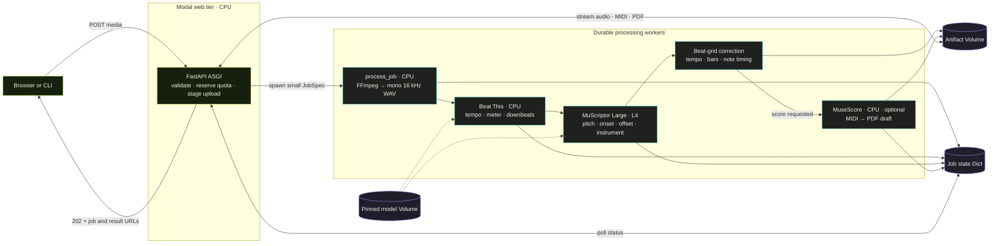
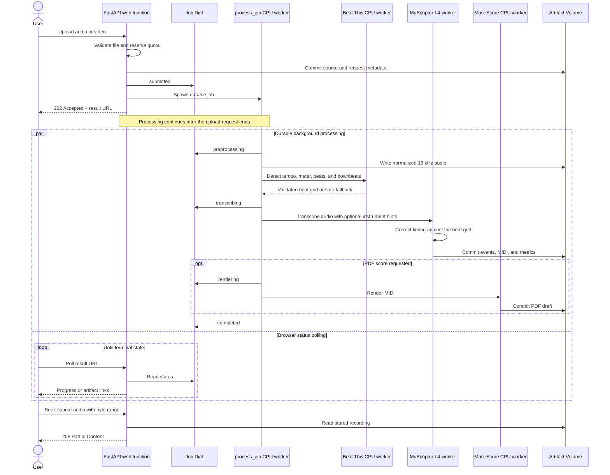

# Auto Transcribe

Transcribe uploaded audio or video into timestamped notes, MIDI, and optional sheet music with MuScriptor Large on Modal.

**[Try Auto Transcribe live →](https://sushruthb03--transcribe.modal.run/)**

The hosted version is a small public beta with shared usage limits. No setup is
required—upload a recording and keep the result URL while the durable job runs.

## Quickstart

You need Python 3.12, [`uv`](https://docs.astral.sh/uv/), a
[Modal account](https://modal.com/), and a [Hugging Face account](https://huggingface.co/).

```bash
git clone https://github.com/sushruth2003/modal-music-transcription.git music-transcription
cd music-transcription
uv sync --dev
uv run modal setup
```

Accept the gated, non-commercial CC BY-NC terms on the
[MuScriptor Large model page](https://huggingface.co/MuScriptor/muscriptor-large),
create a read-only Hugging Face token, and put it in a local `.env` file:

```bash
cp .env.example .env
# Edit .env and replace the placeholder with your token.
uv run modal secret create --from-dotenv .env huggingface-secret
```

Materialize the pinned MuScriptor and Beat This! weights once, then deploy the
workers and web app:

```bash
uv run modal run -m music_transcription.models::download_model
uv run modal deploy -m music_transcription.pipeline
```

Modal prints the web URL after deployment. Open it to upload a WAV, FLAC, MP3,
M4A, OGG, MP4, MOV, WebM, or MKV file (up to 100 MB and ten minutes).
Choose MIDI alone or MIDI plus a printable PDF score. The
page also provides source-audio playback, a synthesized note preview, and a
synchronized piano roll. Instrument conditioning is optional: leave the picker
empty for auto-detection, or select from MuScriptor's exact supported taxonomy.
Selected instruments are hard constraints, not descriptive prompts.

The app intentionally does not fetch remote URLs. Download a video you own or
have permission to process, then upload the file; FFmpeg extracts its audio track
before GPU inference. The public beta accepts at most two submissions per IP
address per rolling hour and five submissions globally per UTC day.

The PDF is an automatically quantized draft derived from model-generated MIDI,
not publication-ready engraving. Use the MIDI in a DAW or notation editor when
you want to refine the transcription.

The CLI remains useful for automation and batches:

```bash
uv run python -m music_transcription.client submit \
  --media data/synthetic-chords-30s.wav \
  --instruments acoustic_piano,drums \
  --score \
  --wait

uv run python -m music_transcription.client submit-batch \
  --directory local-data \
  --limit 4

uv run python -m music_transcription.client status --job-id <job_id>
uv run python -m music_transcription.client download --job-id <job_id>
```

## Architecture



### Job lifecycle



The web function is an I/O layer, not an inference server. `@modal.asgi_app`
adapts FastAPI to Modal, while `@modal.concurrent` lets one CPU container handle
multiple uploads, polls, and downloads. It uses the Volume client API instead of
mounting the artifact Volume, avoiding filesystem reload conflicts between
concurrent requests. The upload is first bounded and streamed through ephemeral
disk, then committed with immutable request metadata. A persistent rate-limit
Dict counts accepted submissions before FastAPI parses the upload body. One web
container handles up to 25 concurrent requests, keeping the quota update
serialized while status and artifact reads remain concurrent. Accepted jobs also
reserve $0.25 from a shared $10 monthly app allowance. That intentionally
conservative estimate is an admission control, not a billing record.

`process_job.spawn()` makes submission asynchronous: the HTTP request can end
while a CPU worker extracts and normalizes the recording's audio, a second CPU
worker detects its beat grid, an L4 worker transcribes it, and an optional CPU
worker renders notation. Those workers exchange Volume paths rather than media
bytes. FFmpeg and Beat This! do not occupy an L4; MuseScore also runs in its own
CPU image. MuScriptor's checkpoint and the exact Beat This! `final0` checkpoint
live on a separate read-only Volume. Each model is loaded by `@modal.enter` once
per warm worker. GPU inference still has `min_containers=0` and
`max_containers=1`, so it scales to zero and only one GPU job runs at a time.

Beat detection is best-effort. Recordings that are too short or do not fit a
steady tempo continue through transcription with MuScriptor's placeholder MIDI
tempo. When a grid is usable, the exported MIDI receives its measured tempo and
time signature, bar lines are aligned to the first downbeat, and MuScriptor's
small global onset lag is corrected in both MIDI and browser events. Source audio
is served with HTTP byte ranges, so the browser can seek without downloading the
recording again. The timing summary and any fallback reason are recorded in
`metrics.json`.

See [Beat-grid correction](BEAT_GRID.md) for the validation thresholds,
onset and bar-offset semantics, checkpoint lifecycle, fallback policy, and
deployment steps.

The durable artifacts for each job are:

```text
jobs/{job_id}/
├── source.<ext>
├── request.json
├── normalized.wav
├── preprocessing.json
├── events.jsonl
├── transcription.mid
├── score.pdf            # when requested
└── metrics.json
```

| Component | Concrete job |
|---|---|
| FastAPI ASGI Function | Accept uploads, return job handles, and serve status/artifacts |
| CPU `process_job` Function | Extract and normalize audio, then coordinate the workers |
| CPU Beat This! class | Keep the beat tracker warm and detect tempo, meter, and downbeats |
| L4 GPU class | Keep MuScriptor resident while warm and run inference |
| CPU score Function | Import MIDI into MuseScore and export a PDF draft |
| Model Volume | Persist both static, pinned checkpoints independently of containers |
| Artifact Volume | Persist source audio and generated files across every stage |
| Dict | Hold small status records, timestamps, errors, and result summaries |
| Rate-limit Dict | Enforce per-IP, daily, and estimated monthly budget quotas |
| `spawn` / `spawn_map` | Start one durable job or fan out a CLI batch without waiting |

The browser turns paired note-start/note-end events into the piano roll. “Source
audio” plays the uploaded audio or the normalized track extracted from a video;
“Transcription preview” schedules a lightweight Web Audio rendition of the detected
notes, so M2 does not need another server-side synthesis worker. MuScriptor Large is
the underlying transcription model, not the name of the application.

## Public hobby deployment

The **[live public app](https://sushruthb03--transcribe.modal.run/)** is the
simplest way to try or share this small beta. The app uses one GPU worker at a time,
scales GPU and beat workers to zero after 30 idle seconds, and uses the quota
rules above to limit accidental use. Its explicit `transcribe` endpoint label
keeps the generated URL short and stable across deployments.

For a real $10 ceiling, set a $10 Workspace budget in Modal's Usage & Billing
settings in addition to the app guard. The app guard cannot measure startup,
CPU, storage, retries, or unrelated workspace usage exactly. If this workspace
also runs other apps, the workspace budget covers those too; use a dedicated
workspace when the cap must apply only to Auto Transcribe.

The site includes a `/how-it-works` page explaining the pipeline, accuracy
expectations, and public-beta limits.

## Browser probe

Install Playwright's Chromium once, then run the repeatable smoke and mocked-result
probe against either a local or deployed URL. It checks desktop and mobile layout,
the How It Works page, MusicXML removal, the completed-result UI, and source-audio
timeline seeking without submitting a paid transcription job.

```bash
uv run playwright install chromium
uv run python scripts/probe_web.py \
  --base-url https://sushruthb03--transcribe.modal.run
```
